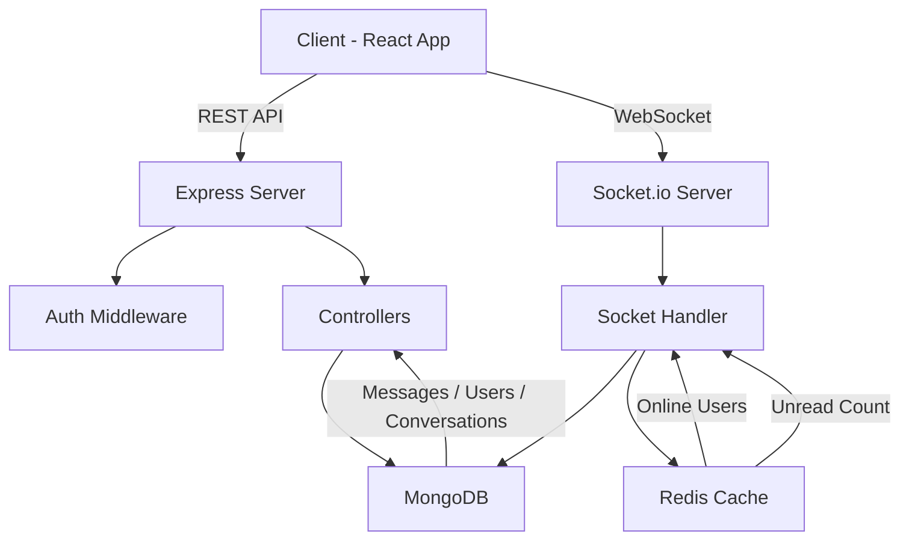

# VHub Backend – Scalable Real-Time Chat System

A **high-performance, real-time chat backend** built with **Node.js, Express, MongoDB, Redis, and Socket.io**, designed to handle **large-scale messaging workloads** with optimized querying, caching, and real-time communication.

---

## Overview

VHub is a **scalable chat backend system** that supports:

- Real-time messaging using WebSockets
- Efficient message storage & retrieval
- Redis-powered caching for unread counts & online users
- Secure authentication with JWT
- Optimized database queries for high performance
- Large dataset support (1M+ messages via seeding)

---

## Architecture

```
Client (Frontend)
       │
       ├── REST APIs (Express)
       │       ├── Auth Routes
       │       ├── User Routes
       │       ├── Message Routes
       │       └── Conversation Routes
       │
       └── WebSockets (Socket.io)
               ├── Real-time messaging
               ├── Typing indicators
               ├── Read receipts
               └── Reactions

Backend
│
├── Controllers (Business Logic)
├── Models (MongoDB - Mongoose)
├── Routes (API Layer)
├── Middleware (Auth, Rate Limiting)
├── Redis (Caching Layer)
└── Socket Handler (Real-time Engine)
```

## System Design Diagram



## Tech Stack

| Layer    | Technology             |
| -------- | ---------------------- |
| Backend  | Node.js, Express       |
| Database | MongoDB (Mongoose ORM) |
| Realtime | Socket.io              |
| Caching  | Redis (ioredis)        |
| Auth     | JWT, bcrypt            |
| Security | Helmet, Rate Limiting  |

---

## Folder Structure

```

VHub-backend/
│
├── config/
│ ├── db.js
│ └── redis.js
│
├── controllers/
│ ├── authController.js
│ ├── userController.js
│ ├── messageController.js
│ └── conversationController.js
│
├── models/
│ ├── User.js
│ ├── Message.js
│ └── Conversation.js
│
├── routes/
│ ├── authRoutes.js
│ ├── userRoutes.js
│ ├── messageRoutes.js
│ └── conversationRoutes.js
│
├── middleware/
│ ├── authMiddleware.js
│ └── rateLimiter.js
│
├── sockets/
│ └── socketHandler.js
│
├── scripts/
│ └── seed.js
│
├── index.js
└── package.json

```

---

## Authentication Flow

- Users register → password hashed using **bcrypt**
- Login → JWT issued with 7-day expiry
- Protected routes use middleware:
- Extract token from headers
- Verify JWT
- Attach user to request

---

## Core Features

### 1. Real-Time Messaging

- Socket.io enables instant message delivery
- Auto-creates conversation if not exists
- Emits:
  - `receive-message`
  - `typing`
  - `stop-typing`

---

### 2. Online Presence System

- Tracks active users via Redis:
  - `online:userId → socketId`

- Broadcasts active users list globally

---

### 3. Unread Message Counter (Redis Optimized)

- Redis key:

```

unread:userId:conversationId

```

- Incremented on message send
- Lazy fallback to DB if cache miss

---

### 4. Message Search & Pagination

- Supports:
- Full-text regex search
- Pagination (skip + limit)

- Optimized sorting strategy:
- Reverse after fetch for chronological order

---

### 5. Read Receipts

- Marks unseen messages as seen automatically
- Clears Redis unread count on read

---

### 6. Message Reactions

- Add / update / remove emoji reactions
- Stored inside message document

---

### 7. Message Deletion (Advanced)

Supports:

- Delete for me
- Delete for everyone
- Maintains message integrity:
- `deletedFor[]`
- `isDeletedForEveryone`

---

### 8. Reply System

- Messages can reference another message
- Uses `replyTo` field for threading

---

### 9. Security Features

- Rate limiting on login (prevents brute force)
- JWT authentication
- Password hashing

---

## Database Design

### User Model

- name, email, password
- online status + lastSeen

---

### Message Model

- sender, conversation
- text, image
- reactions, replies
- deletion flags
- Indexed for fast queries:

```js
{ conversation: 1, createdAt: -1 }
```

---

### Conversation Model

- participants[]
- lastMessage

---

## API Endpoints

### Auth

```
POST /api/auth/register
POST /api/auth/login
```

---

### Users

```
GET    /api/users
PUT    /api/users/:id
DELETE /api/users/:id
```

---

### Messages

```
GET    /api/messages/:userId
DELETE /api/messages/:messageId
```

---

### Conversations

```
GET /api/conversations
```

---

## Performance Optimizations

### Redis Caching

- Unread counts cached → reduces DB hits
- Online users stored in Redis

---

### Lean Queries

- `.lean()` used → reduces memory overhead

---

### Batch Seeding

- Supports **1M+ messages**
- Uses batching (1000 docs per insert)

---

### Async Updates

- Seen updates run asynchronously (non-blocking)

---

## Socket Events

| Event             | Description           |
| ----------------- | --------------------- |
| `user-connected`  | Register user online  |
| `send-message`    | Send message          |
| `receive-message` | Receive message       |
| `typing`          | Typing indicator      |
| `stop-typing`     | Stop typing           |
| `mark-seen`       | Mark messages as read |
| `delete-message`  | Delete message        |
| `react-message`   | React to message      |

---

## Data Seeding

- Generates:
  - 500 users
  - 500 conversations
  - ~1,000,000 messages

- Uses Faker for realistic data

---

## Environment Variables

```
MONGO_URI=your_mongodb_uri
JWT_SECRET=your_secret
REDIS_URL=your_redis_url
```

---

## Getting Started

```bash
# Clone repo
git clone https://github.com/svivek19/VHub-backend.git

# Install dependencies
npm install

# Run dev server
npm run dev
```

---

## Future Improvements

- Full-text search with Elasticsearch
- Message queue (Kafka / RabbitMQ)
- Microservices architecture
- Push notifications

---

## Author

**Vivekananthan S**
